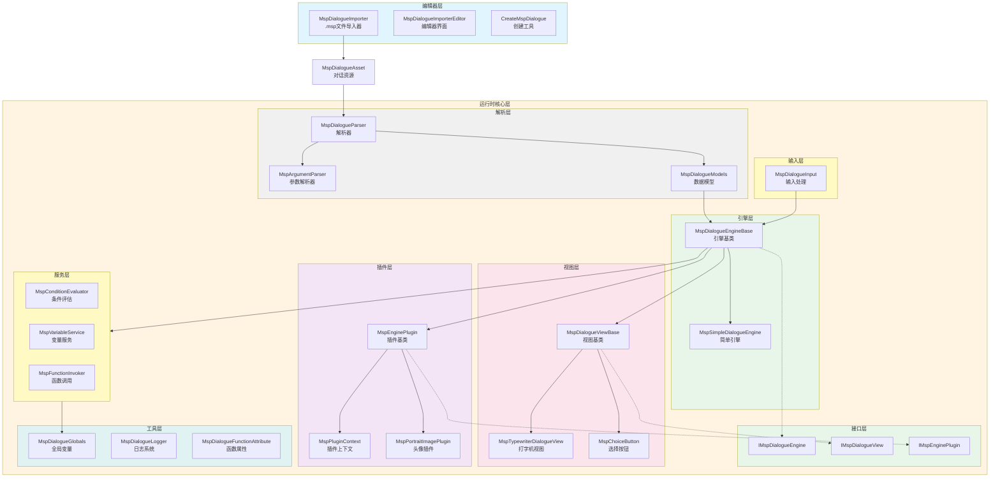
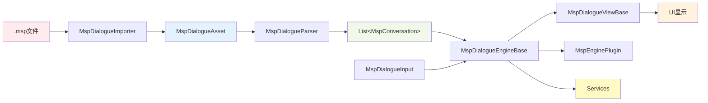
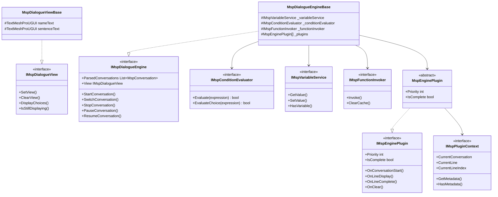
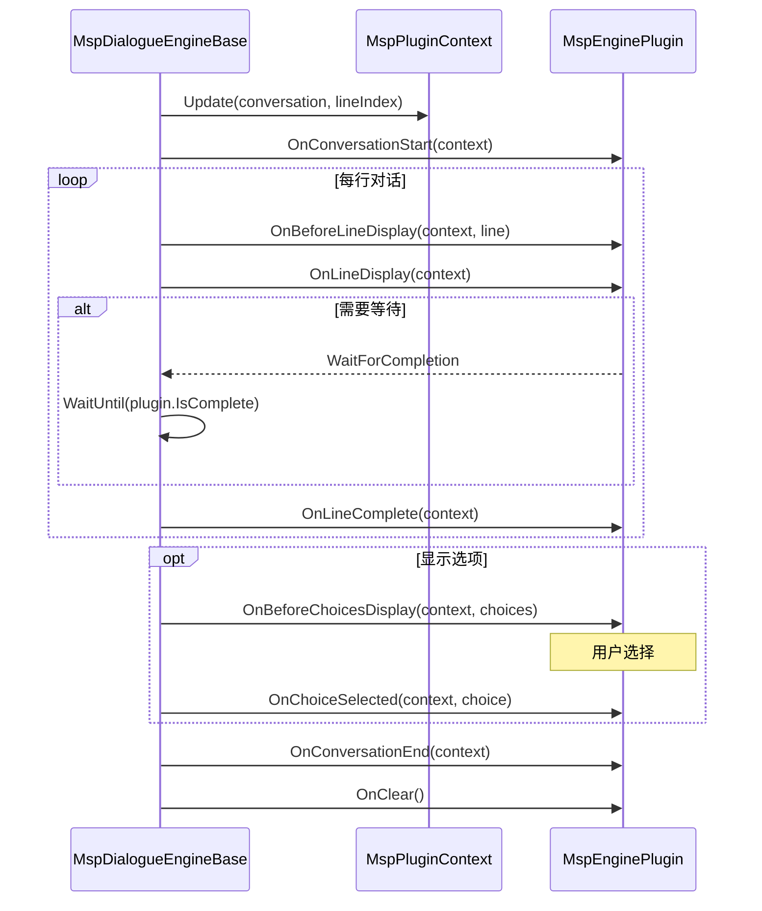
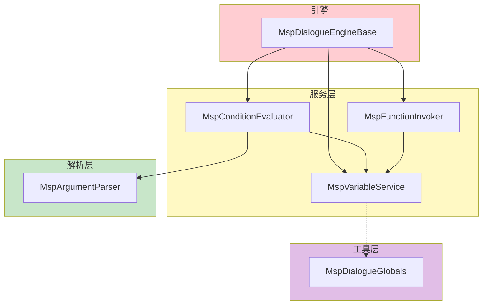

# MSpeaker 项目架构图 (Mermaid 格式)

## 系统架构图



## 数据流图



## 类关系图



## 插件生命周期



## 服务依赖关系



## 目录结构

```
Runtime/
├── Interfaces/
│   ├── IMspDialogueEngine.cs
│   ├── IMspDialogueView.cs
│   └── IMspEnginePlugin.cs
├── Parser/
│   ├── MspArgumentParser.cs
│   ├── MspDialogueModels.cs
│   └── MspDialogueParser.cs
├── Plugins/
│   ├── MspEnginePlugin.cs
│   ├── MspPluginContext.cs
│   └── MspPortraitImagePlugin.cs
├── Services/
│   ├── IMspConditionEvaluator.cs
│   ├── IMspFunctionInvoker.cs
│   ├── IMspVariableService.cs
│   ├── MspConditionEvaluator.cs
│   ├── MspFunctionInvoker.cs
│   └── MspVariableService.cs
├── Utils/
│   ├── MspDialogueFunctionAttribute.cs
│   ├── MspDialogueGlobals.cs
│   └── MspDialogueLogger.cs
├── Views/
│   ├── MspChoiceButton.cs
│   ├── MspDialogueViewBase.cs
│   └── MspTypewriterDialogueView.cs
├── MspDialogueAsset.cs
├── MspDialogueEngineBase.cs
├── MspDialogueInput.cs
└── MspSimpleDialogueEngine.cs
```
