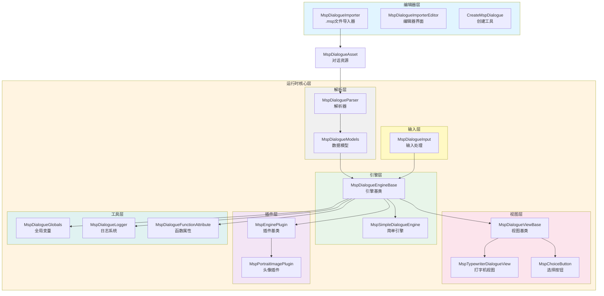
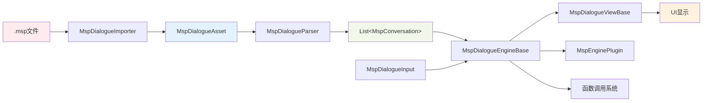
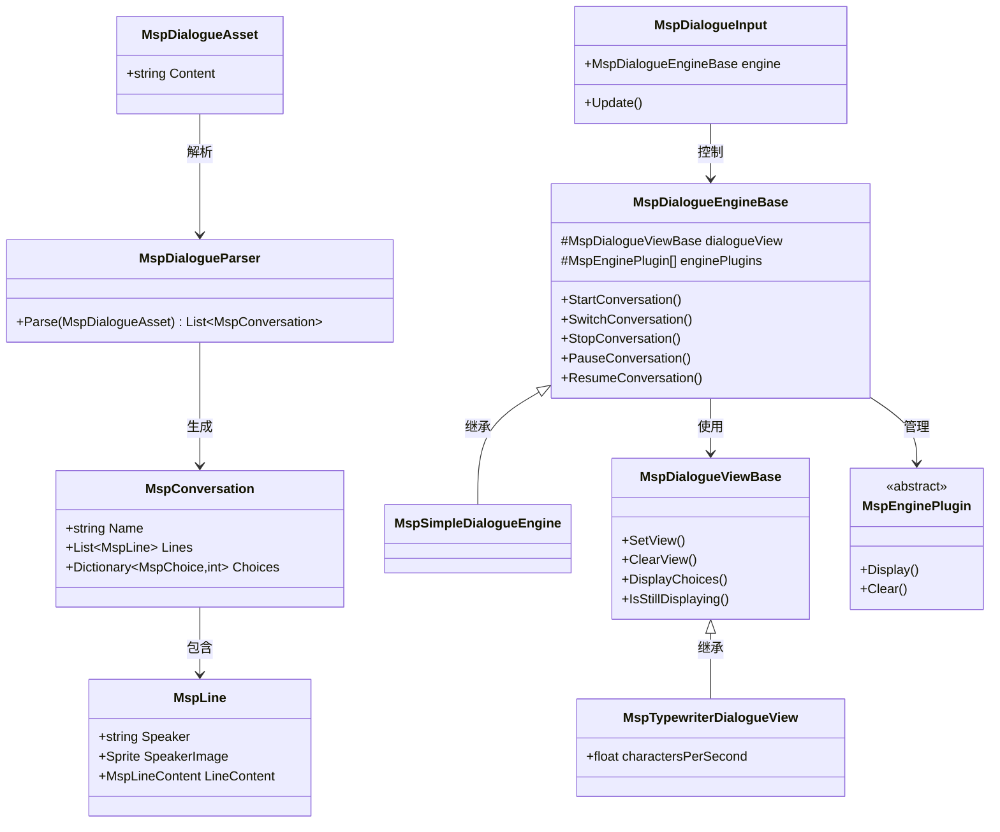
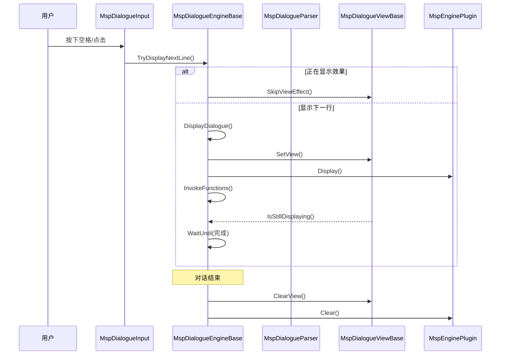
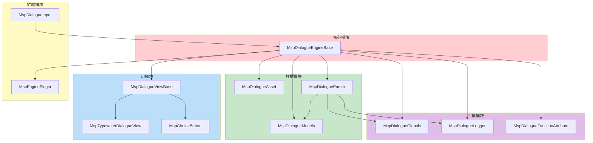

# MSpeaker 项目架构图 (Mermaid 格式)

## 系统架构图

```mermaid
graph TB
    subgraph Editor["编辑器层"]
        Importer[MspDialogueImporter<br/>.msp文件导入器]
        ImporterEditor[MspDialogueImporterEditor<br/>编辑器界面]
        CreateTool[CreateMspDialogue<br/>创建工具]
    end

    subgraph Runtime["运行时核心层"]
        subgraph Parser["解析层"]
            ParserCore[MspDialogueParser<br/>解析器]
            Models[MspDialogueModels<br/>数据模型]
        end

        subgraph Engine["引擎层"]
            EngineBase[MspDialogueEngineBase<br/>引擎基类]
            SimpleEngine[MspSimpleDialogueEngine<br/>简单引擎]
        end

        subgraph Views["视图层"]
            ViewBase[MspDialogueViewBase<br/>视图基类]
            TypewriterView[MspTypewriterDialogueView<br/>打字机视图]
            ChoiceButton[MspChoiceButton<br/>选择按钮]
        end

        subgraph Plugins["插件层"]
            PluginBase[MspEnginePlugin<br/>插件基类]
            PortraitPlugin[MspPortraitImagePlugin<br/>头像插件]
        end

        subgraph Input["输入层"]
            InputHandler[MspDialogueInput<br/>输入处理]
        end

        subgraph Utils["工具层"]
            Globals[MspDialogueGlobals<br/>全局变量]
            Logger[MspDialogueLogger<br/>日志系统]
            FunctionAttr[MspDialogueFunctionAttribute<br/>函数属性]
        end
    end

    Asset[MspDialogueAsset<br/>对话资源]

    Importer --> Asset
    Asset --> ParserCore
    ParserCore --> Models
    Models --> EngineBase
    EngineBase --> SimpleEngine
    EngineBase --> ViewBase
    ViewBase --> TypewriterView
    ViewBase --> ChoiceButton
    EngineBase --> PluginBase
    PluginBase --> PortraitPlugin
    InputHandler --> EngineBase
    EngineBase --> Globals
    EngineBase --> Logger
    EngineBase --> FunctionAttr

    style Editor fill:#e1f5ff
    style Runtime fill:#fff4e1
    style Parser fill:#f0f0f0
    style Engine fill:#e8f5e9
    style Views fill:#fce4ec
    style Plugins fill:#f3e5f5
    style Input fill:#fff9c4
    style Utils fill:#e0f2f1
```

## 数据流图

```mermaid
flowchart LR
    A[.msp文件] --> B[MspDialogueImporter]
    B --> C[MspDialogueAsset]
    C --> D[MspDialogueParser]
    D --> E[List&lt;MspConversation&gt;]
    E --> F[MspDialogueEngineBase]
    F --> G[MspDialogueViewBase]
    G --> H[UI显示]
    F --> I[MspEnginePlugin]
    F --> J[函数调用系统]
    K[MspDialogueInput] --> F

    style A fill:#ffebee
    style C fill:#e3f2fd
    style E fill:#f1f8e9
    style H fill:#fff3e0
```

## 类关系图

```mermaid
classDiagram
    class MspDialogueAsset {
        +string Content
    }

    class MspDialogueParser {
        +Parse(MspDialogueAsset) List~MspConversation~
    }

    class MspConversation {
        +string Name
        +List~MspLine~ Lines
        +Dictionary~MspChoice,int~ Choices
    }

    class MspLine {
        +string Speaker
        +Sprite SpeakerImage
        +MspLineContent LineContent
    }

    class MspDialogueEngineBase {
        #MspDialogueViewBase dialogueView
        #MspEnginePlugin[] enginePlugins
        +StartConversation()
        +SwitchConversation()
        +StopConversation()
        +PauseConversation()
        +ResumeConversation()
    }

    class MspSimpleDialogueEngine {
    }

    class MspDialogueViewBase {
        +SetView()
        +ClearView()
        +DisplayChoices()
        +IsStillDisplaying()
    }

    class MspTypewriterDialogueView {
        +float charactersPerSecond
    }

    class MspEnginePlugin {
        <<abstract>>
        +Display()
        +Clear()
    }

    class MspDialogueInput {
        +MspDialogueEngineBase engine
        +Update()
    }

    MspDialogueAsset --> MspDialogueParser : 解析
    MspDialogueParser --> MspConversation : 生成
    MspConversation --> MspLine : 包含
    MspDialogueEngineBase <|-- MspSimpleDialogueEngine : 继承
    MspDialogueEngineBase --> MspDialogueViewBase : 使用
    MspDialogueViewBase <|-- MspTypewriterDialogueView : 继承
    MspDialogueEngineBase --> MspEnginePlugin : 管理
    MspDialogueInput --> MspDialogueEngineBase : 控制
```

## 执行流程图

```mermaid
sequenceDiagram
    participant User as 用户
    participant Input as MspDialogueInput
    participant Engine as MspDialogueEngineBase
    participant Parser as MspDialogueParser
    participant View as MspDialogueViewBase
    participant Plugin as MspEnginePlugin

    User->>Input: 按下空格/点击
    Input->>Engine: TryDisplayNextLine()
    
    alt 正在显示效果
        Engine->>View: SkipViewEffect()
    else 显示下一行
        Engine->>Engine: DisplayDialogue()
        Engine->>View: SetView()
        Engine->>Plugin: Display()
        Engine->>Engine: InvokeFunctions()
        View-->>Engine: IsStillDisplaying()
        Engine->>Engine: WaitUntil(完成)
    end

    Note over Engine: 对话结束
    Engine->>View: ClearView()
    Engine->>Plugin: Clear()
```

## 模块依赖关系

```mermaid
graph TD
    subgraph Core["核心模块"]
        Engine[MspDialogueEngineBase]
    end

    subgraph Data["数据模块"]
        Asset[MspDialogueAsset]
        Parser[MspDialogueParser]
        Models[MspDialogueModels]
    end

    subgraph UI["UI模块"]
        View[MspDialogueViewBase]
        Typewriter[MspTypewriterDialogueView]
        Choice[MspChoiceButton]
    end

    subgraph Ext["扩展模块"]
        Plugin[MspEnginePlugin]
        Input[MspDialogueInput]
    end

    subgraph Util["工具模块"]
        Globals[MspDialogueGlobals]
        Logger[MspDialogueLogger]
        FunctionAttr[MspDialogueFunctionAttribute]
    end

    Engine --> Asset
    Engine --> Parser
    Engine --> Models
    Engine --> View
    Engine --> Plugin
    Engine --> Globals
    Engine --> Logger
    Engine --> FunctionAttr
    View --> Typewriter
    View --> Choice
    Input --> Engine
    Parser --> Models
    Parser --> Globals
    Parser --> Logger

    style Core fill:#ffcdd2
    style Data fill:#c8e6c9
    style UI fill:#bbdefb
    style Ext fill:#fff9c4
    style Util fill:#e1bee7
```
